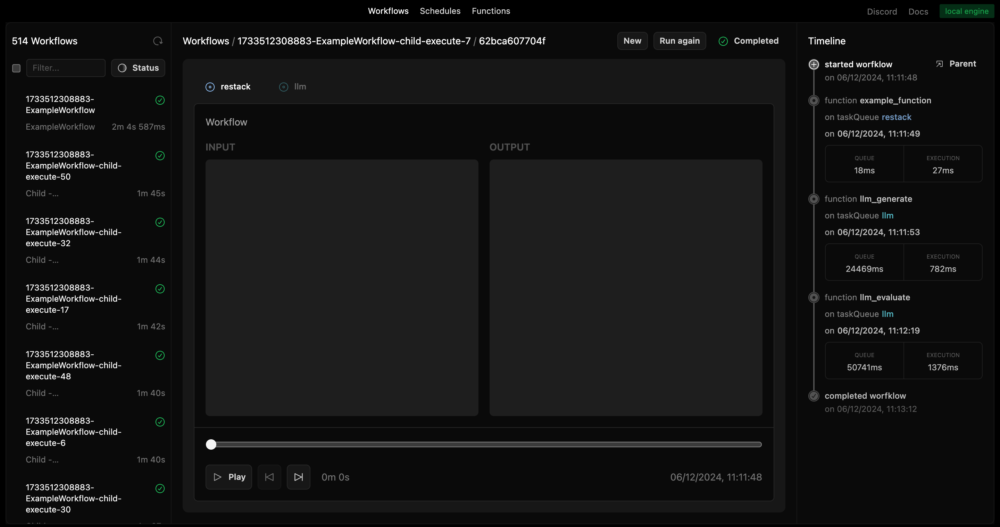

# Restack AI - Recall Example

This repository demonstrates how to build a production-ready AI backend using [Restack](https://docs.restack.io) and [Recall](https://docs.recall.ai). It combines Recall’s universal API for capturing meeting data in real-time with Restack’s framework to build resilient ai workflows to handle concurrency, retries, and scheduling at scale.

## Overview

This example shows how to reliably scale workflows on a local machine, capturing meeting audio, video, and metadata via Recall, then processing it using Restack. You can define concurrency limits, automatically retry failed steps, and focus on building robust logic without managing manual locks or queues.

## Walkthrough Video


## Motivation

When building AI meeting-related workflows, you want to handle real-time data ingestion (Recall) along with safe, scalable processing (Restack). Restack ensures steps that call LLM APIs or other services adhere to concurrency constraints, automatically queueing and retrying operations to maintain reliability.

### Workflow Steps

Below is an example of 50 workflows in parallel, each using Recall data and calling LLM functions that are rate-limited to 1 concurrent call per second.

| Step | Workflow 1 | Workflow 2 | ... | Workflow 50 |
| ---- | ---------- | ---------- | --- | ----------- |
| 1    | Recall     | Recall     | ... | Recall      |
| 2    | Recall     | Recall     | ... | Recall      |
| 3    | LLM        | LLM        | ... | LLM         |

### Rate Limit Management

When processing data from Recall in parallel, you might rely on LLM or other external services. Managing concurrency is crucial:

1. **Task Queue**: Traditional approach using Celery or RabbitMQ.  
2. **Rate Limiting Middleware**: Custom logic to hold requests in a queue.  
3. **Semaphore or Locking**: Single shared lock to ensure serial processing.

### With Restack

Restack automates rate-limit management and concurrency controls:

```python
client.start_service(
    task_queue="llm",
    functions=[llm_generate, llm_evaluate],
    options=ServiceOptions(
        rate_limit=1,
        max_concurrent_function_runs=1
    )
)
```

Combine your Recall steps (fetch meeting transcripts, metadata, etc.) with LLM calls, and Restack ensures each step is handled in order without manual synchronization.

## On Restack UI

You can see how long each workflow or step stayed in the queue and the execution details:


For each child workflow, you can see how many retries occurred and how long each function took to execute:



## Prerequisites

- Python 3.10 or higher
- Poetry (for dependency management)
- Docker (for running Restack)
- Recall account and API key
- (Optional) Gemini LLM API key

## Prepare Environment

Create a `.env` file from `.env.Example`:

```
RECALL_API_KEY=<your-recall-api-key>
GEMINI_API_KEY=<your-gemini-api-key>
...
```

## Start Restack

```bash
docker run -d --pull always --name restack -p 5233:5233 -p 6233:6233 -p 7233:7233 ghcr.io/restackio/restack:main
```

## Start Python Shell

```bash
poetry env use 3.10 && poetry shell
```

## Install Dependencies

```bash
poetry install
poetry env info
```

## Development

```bash
poetry run dev
```

This will start the Restack services locally, using your configured environment.

## Run Workflows

### From UI

Access http://localhost:5233 to see your workflows. Click “Run” to start them.


### From API

Use the generated endpoints for your workflows:

`POST http://localhost:6233/api/workflows/ChildWorkflow`

or

`POST http://localhost:6233/api/workflows/ExampleWorkflow`

### From CLI

```bash
poetry run schedule
```

Triggers `ChildWorkflow`.

```bash
poetry run scale
```

Triggers `ExampleWorkflow` 50 times in parallel.

```bash
poetry run interval
```

Schedules `ChildWorkflow` every second.

## Deploy on Restack Cloud

Create an account at [https://console.restack.io](https://console.restack.io). You can deploy your workflows to Restack Cloud for automated scaling and monitoring.

## Project Structure

- `src/`
  - `client.py`: Initializes Restack client
  - `functions/`: Contains function definitions
  - `workflows/`: Contains workflow definitions (including steps that leverage Recall data)
  - `services.py`: Sets up Restack services
- `schedule_workflow.py`: Scheduling a single workflow
- `schedule_interval.py`: Scheduling a workflow repeatedly
- `schedule_scale.py`: Scheduling 50 workflows at once
- `.env.Example`: Environment variable template for Recall and Gemini keys

# Conclusion

With Recall providing real-time meeting data and Restack handling durable, concurrent workflows, you can build a powerful AI-backed system for processing, summarizing, and analyzing meetings at scale. This setup dramatically reduces operational overhead, allowing you to focus on delivering meaningful product features without worrying about rate limits or concurrency.
